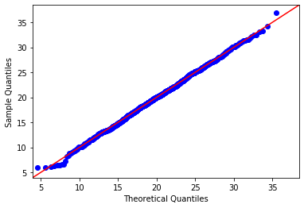

```python

import numpy as np
import statsmodels.api as sm
import pylab
from scipy.stats import sem
```


```python

```


```python
test=np.random.normal(20,5,1000)
sm.qqplot(test,loc=20,scale=5,line="45")
pylab.show()
```





```python
#1.Explain why the points don’t lie on the line y=x
```

This Q–Q plot compares a sample of data on the vertical axis to a statistical population on the horizontal axis.
The points follow a strongly linear pattern, suggesting that the data are distributed as a standard normal (X ~ N(0,1)). The offset between the line and the points suggests that the mean of the data is not 1.


```python
#2.what is standard error of the mean?
```

SEM:
The standard error of the mean is the standard deviation of the sampling distribution of the mean. The formula for the standard error of the mean in a population is:

Mathematically, the standard error of the mean formula is given by:<br>
Standard Error of the Mean<br>
$$\sigma_M = \frac{\sigma}{\sqrt{N}}$$<br>
where,<br>
$\sigma_M$ = the standard deviation of the original distribution<br> 
$N$ = the sample size<br>
${\sqrt{N}}$ = root of the sample size<br>

From the formula we can assume that the standard error of the mean decreases as N increases. This is an expected, if the mean at each step is calculated using many data points, then a small deviation in one value will cause less effect on the final mean.


```python
#3.simulate SEM example using NumPy
```


```python
std=np.random.normal(20,5,10000)
std
```


    array([15.65024753, 22.949658  ,  6.01874723, ..., 20.59312831,
           19.38274894, 18.70527866])


```python
sem(std)
```


    0.05036580954675853


```python
np.std(std)
```


    5.036329119332078


```python

```
